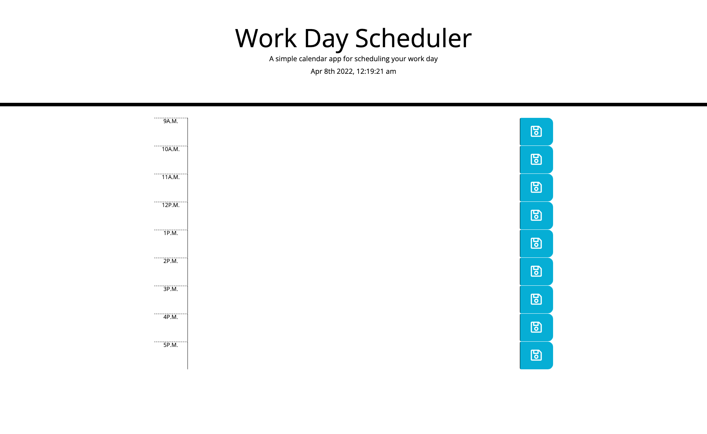

# work-day-scheduler
simple calendar application that allows a user to save events for each hour of the day

## Workday Scheduler homework ucf bootcamp

## composed by
Stephanie Chaparro

## project location ##
[repo link](https://github.com/schaparro08/work-day-scheduler)
[live link](https://schaparro08.github.io/work-day-scheduler/)

**contact information**
schaparro2021@gmail.com

Project example

## Description
This workday calendar uses Bootstrap and jQuery in order to create a calendar that displays the current hour as red, the future as green and the past as grey. It also allows for text to be added on the calendar and saved.

